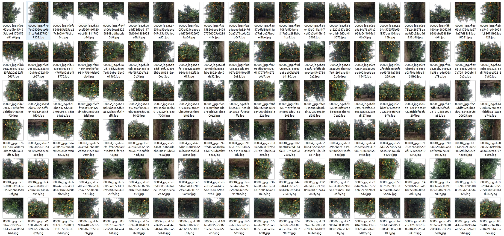
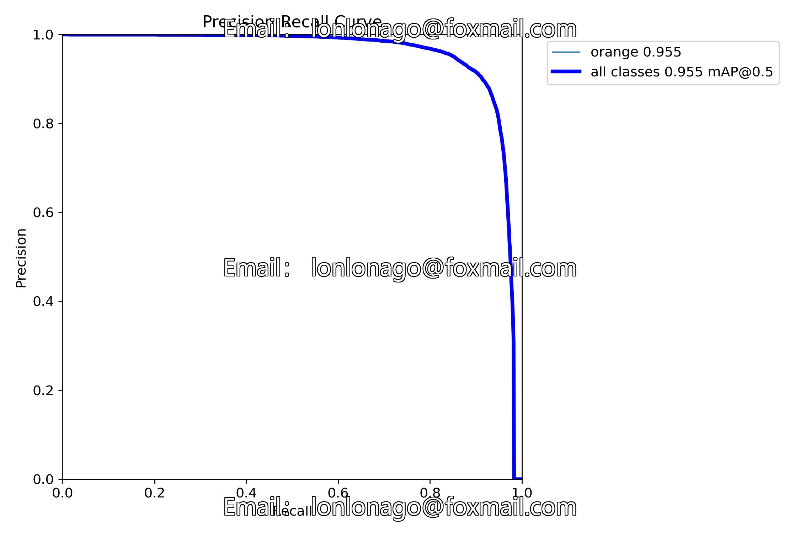
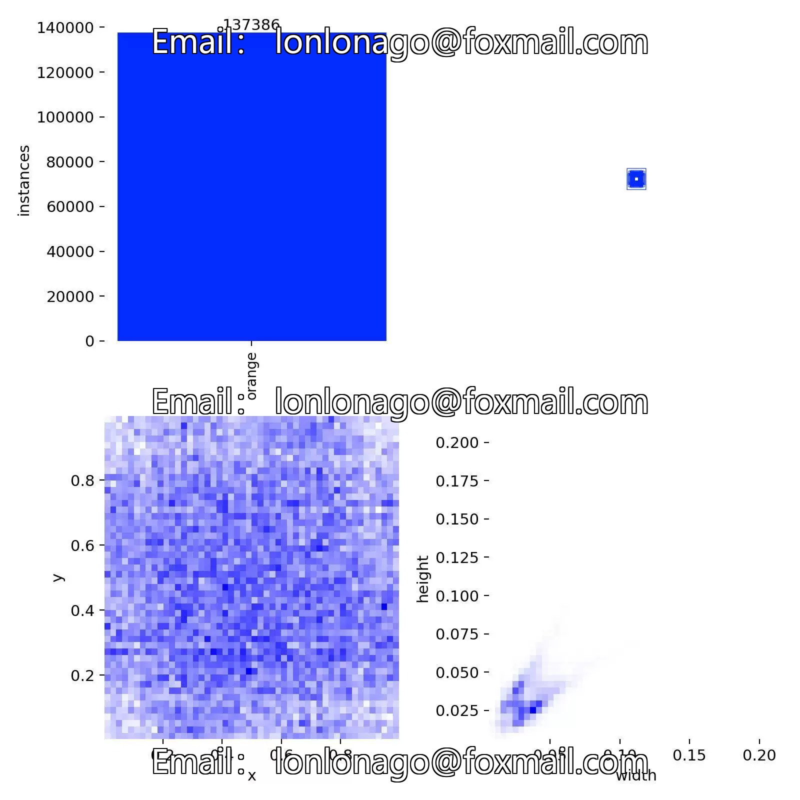
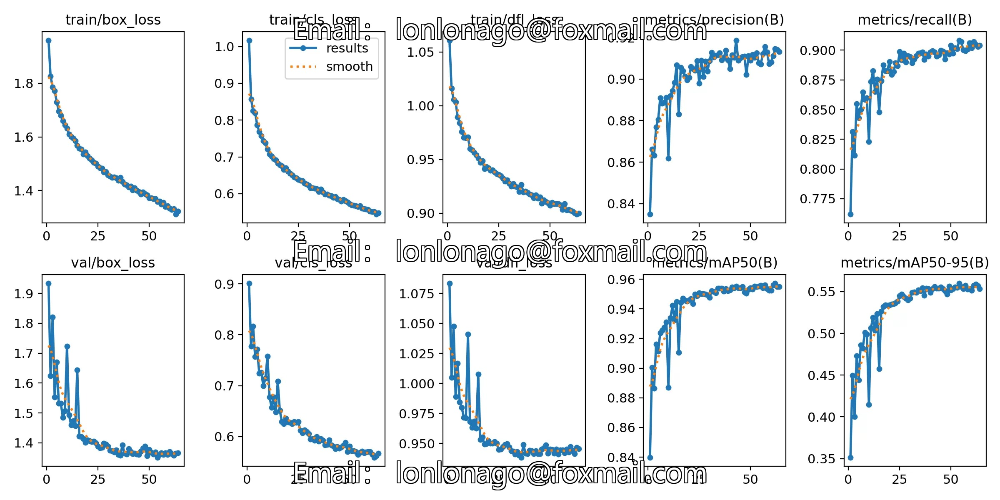
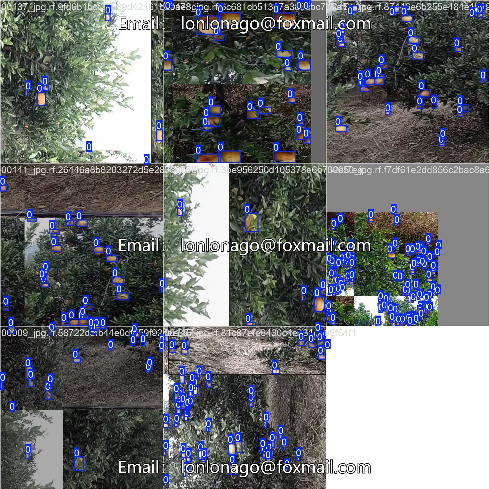
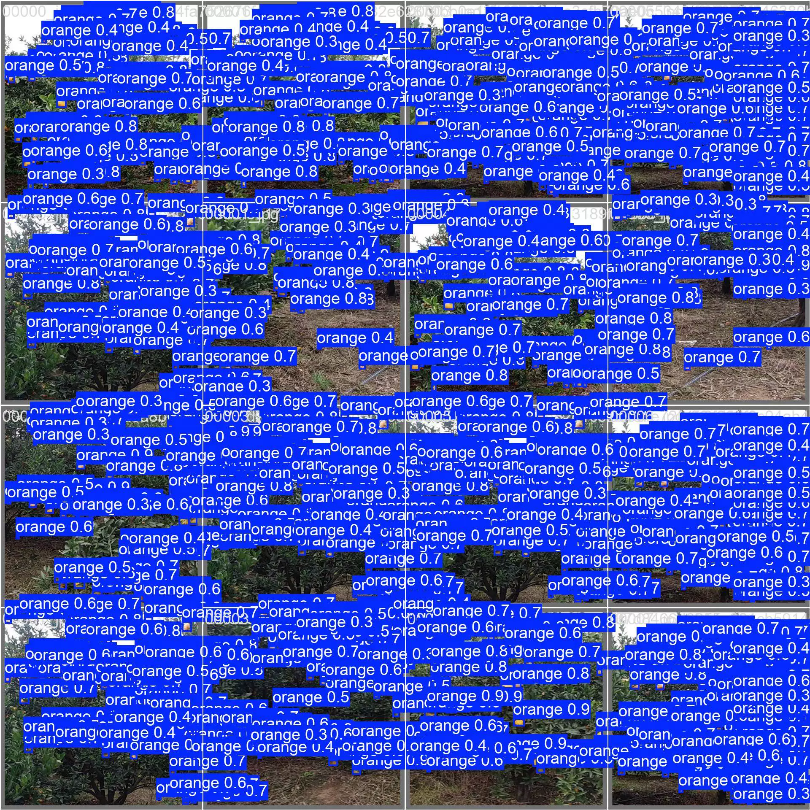
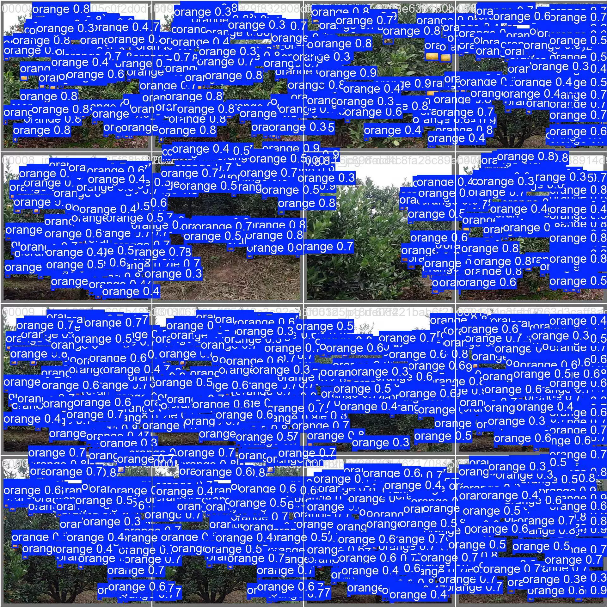

## Body

（Agricultural Product）Orange Target Detection Dataset in YOLO format

Totally 3710 images, labeled with tags and YOLO format has been divided into train (2970), valid (370), test (370)

It is divided into one category, which are oranges. The dataset has data augmentation.

YOLOv8s Object Detection Weight File (Training rounds 100, pre-trained model YOLOv8s.pt, mAP@0.5 0.955) with training results file

Electronic virtual products sold without return or exchange.

## Images

Here is a pay link on Stripe ( https://buy.stripe.com/3cs8yP7sY87d0vu9AB ). Please contact me lonlonago@foxmail.com after funding $89, and I will send you a complete data files , thank you!

